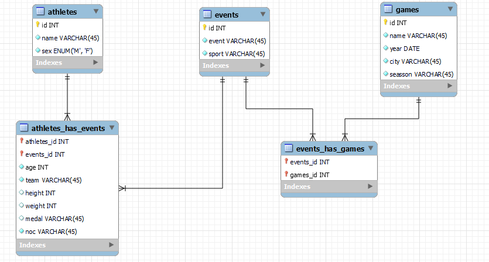

# Desafio processo seletivo CELERO

### Modelagem Banco de Dados

 * athlete(id, name, sex)
 * events(id, event, sport)
 * game(id, game, year, city, season)
 * athletehasevents(athleteId_id, eventId_id, age, team, height, weight, medal, noc, game)
 * eventshasgame(eventId_id, gameId_id)

 >A tabela eventshasgame é claramente uma tabela associativa de um relacinamento n -> m, e nesse cenário também considerei a athletehasevents como uma tabela associativa entre athlete e event, a diferença que nesse caso ela possui atributos próprios, desses atributos fiquei na dúvida se deixaria o campo "age" na tabela athlete ou na atheletehasevents e optei pela última já que entendo que sua idade é diferente em cada evento

 ## execução
Na pasta raiz do projeto rodar o comando para instaçar as dependências

> pip install -r requirements.txt

rodar as migration:
> python manage.py makemagrations  
> python manage.py migrate

executar comando para importar os dados do dataset na base de dados
> python manage.py add_data

Subir o servidor python
> python manage.py runserver

## Rotas

> "atlhetes": "http://localhost:8000/atlhetes/",  
    "events": "http://localhost:8000/events/", 
    "atlhete_has_events": "http://localhost:8000/atlhete_has_events/",  
    "games": "http://localhost:8000/games/"